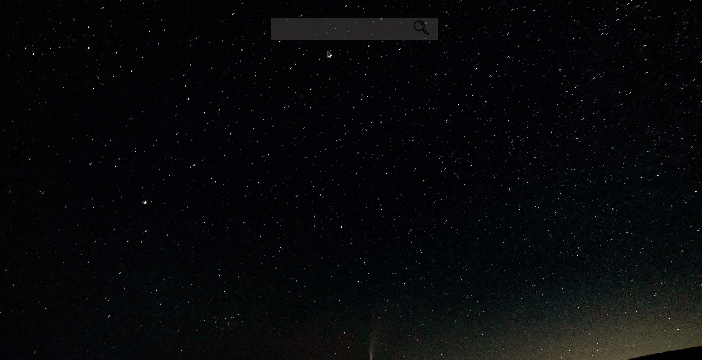

# Weather Application

[Live Demo](https://eddomiw.github.io/weather-app/)

## Short Description :

This weather app utilizes a weather API to fetch data and enables users to search locations, providing essential weather details such as conditions, temperature, feels like, humidity, and wind speed.

## Features :

- Clean UI/UX
- Weather API Fetching
- Responsive layout for desktop and mobile applications

## Technologies Used :

- SCSS
- JavaScript
- Webpack

## Learning Outcomes:

- Proficiency in Media Queries: Through implementing media queries, I acquired a deeper understanding of creating responsive layouts for both mobile and desktop versions of the website. This involved adapting the display based on screen size, enabling a seamless user experience across different devices.

- Utilizing npm for SASS Actions: Instead of relying on the Live Sass Compiler extension in vscode, I opted to utilize npm for performing SASS actions and managing files. This decision allowed me to gain a better understanding of webpack configuration and how to effectively integrate JavaScript and CSS files in a single webpack entry file.

- Enhanced JavaScript File Organization: Building upon my previous project experience, I implemented a more organized approach to managing JavaScript files. Instead of having a single large JavaScript file, I successfully divided multiple actions and functionalities into three separate files. This modular structure allowed for better code organization and improved maintainability.

- Working with APIs and Asynchronous Programming: The primary objective of this project was to comprehend the functioning of APIs in conjunction with callbacks and promises, leveraging syntactical sugar like 'await' and 'async' to achieve the desired application. Through this process, I developed a strong understanding of handling asynchronous operations and effectively utilizing API data within the application.

## Motivation:

Building upon my previous to-do list application, I focused on improving JavaScript file management by addressing the issue of having excessively long files. I actively sought opportunities to split functionalities into separate files, ensuring a more organized codebase and eliminating the need for constant scrolling.

Additionally, I enhanced my project by leveraging npm for SCSS usage instead of relying solely on vscode extensions, considering the potential lack of support for certain extensions. This decision allowed me to gain a deeper understanding of integrating JavaScript and CSS files using webpack, resulting in a more comprehensive grasp of file interactions and the necessary configurations for successful output.

Furthermore, this project contributed to my growing proficiency in object-oriented programming, particularly in the context of working with APIs and .json files. I developed a greater comfort level in understanding and manipulating objects, facilitating quicker decision-making processes when working with them. This enhanced understanding of object-oriented programming has not only positively impacted the weather app but also equips me with valuable skills for future projects.
